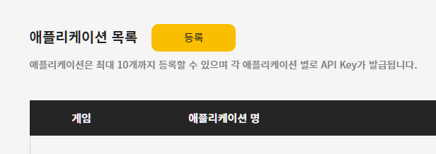
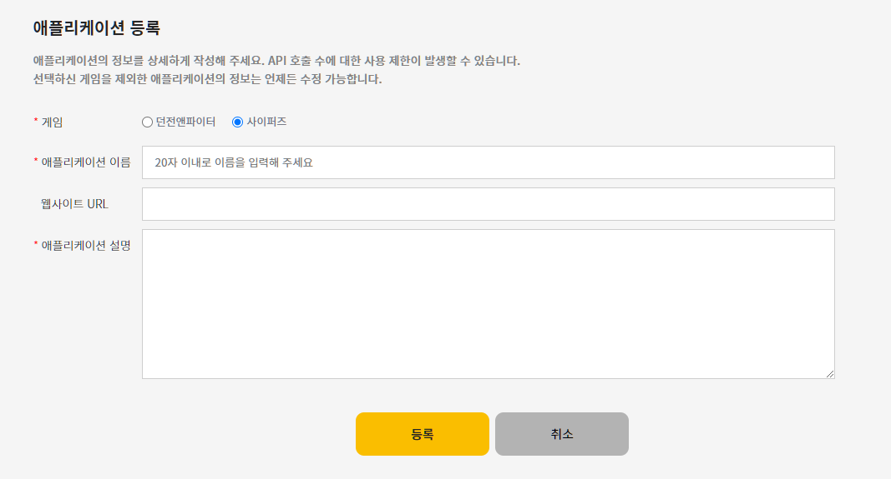
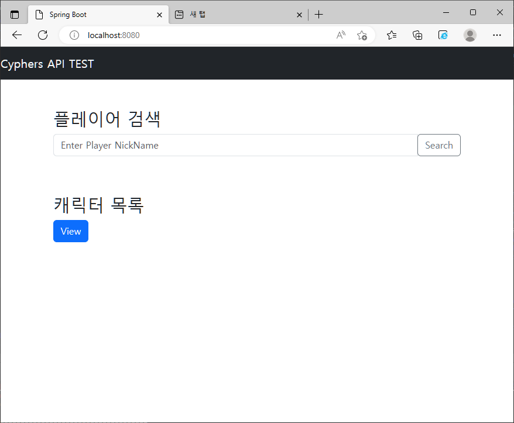
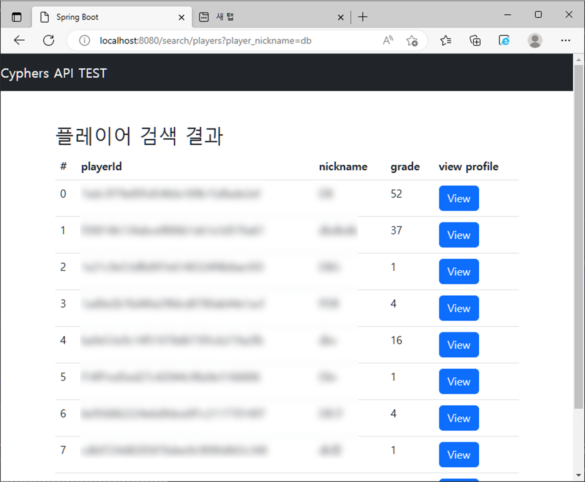
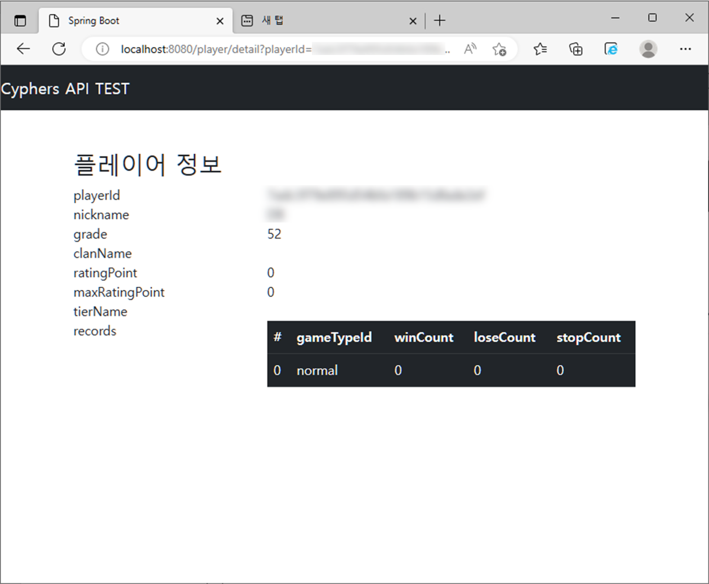
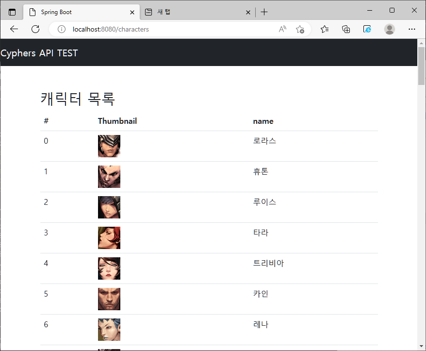

# Cyphers API TEST
## 1. 사이퍼즈 open api 클라이언트 등록, 클라이언트 키 발급

네오플 개발자 사이트에 로그인 후 아래 링크에서 새 클라이언트를 등록한다.<br>
<https://developers.neople.co.kr/manage/app/list>

</img><br/>

</img><br/>


게임은 사이퍼즈, 앱 이름과 설명은 적당히 작성한다.

</img><br/>

생성하고 나면 api key를 발급 받는데, 이 키를 본 프로젝트의 com.dev.cy.common 패키지에 있는 Constants.java의 API_CLIENT 변수에 작성한다.

```Java
package com.dev.cy.common;

public class Constants {
	// api 통신에 필요한 키값, 네오플에서 발급받는다.
	public static String API_CLIENT = "<Your API Key>";

	public static String REQ_BASE_URL = "https://api.neople.co.kr";

	// 플레이어 리스트 검색 및 특정 id로 플레이어 상세 검색
	public static String REQ_PLAYERS_URL = "/cy/players";
	// 캐릭터 리스트 호출
	public static String REQ_CHARACTERS = "/cy/characters";

}
```

# Preview

</img><br/>

</img><br/>

</img><br/>

</img><br/>
